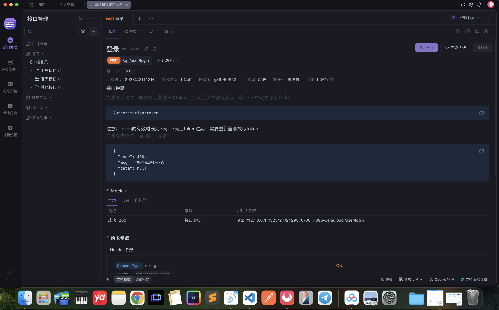

<!-- 
This file will be used to generate the contents on the webpage, here are some rules and instructions: 

(will show in 
)
#: will be h2title (will be an <h2></h2> tag for title, please see the example: )
#date: date  (will show under the title, 
date
 ) 
#author: for author (
Yuanfeng Li
)
#others: for some comments, or other msgs (
工欲善其事，必先利其器
)

(will show in 
)
##: will be h3, 
###: will be h4
#p: will be a p before anyother # (hashtags)
#img: will be at the location and transform to a fixed width and height img. 

ATTENTION:
all 
 will be under 

Example: 

                

                    <h2 class="date">Feb-16-2025</h2>
                    
Week7 of 2025

                

                

                    <h3>Investment: </h3>
                    

                        1. 卖飞，赚了但感觉亏了？（- PLTR，sold at $103，bought at 68 for $1000。） as of today-Feb/16/2025- 118.78。
                        earned 450$。sold all 12.5 shares。引发的思考，1）为什么会卖飞？2）为什么我没有阶段性止盈？3）造成fomo的root cause到底是什么？
                    

                    

                        2. BYD， bought at 70 sold at 71 earned
                        $2。AOTP：93.38。1）为什么会卖飞？-主要因为我看了两个月觉得一直萎靡不振。买的那天还幸运的开始涨价。但是由于天神之眼全面普及，投资者信心大增，我却没有遇见。
                    

                    

                        3. costco/walmart 都有类似的情况就不一一举例了。
                    

                    
                    <h3>Career/Job: </h3>
                    <h4>
                        渡一课程:
                    </h4>
                    

                        - 学习了函数，Js6，btml前段面试题目1）我的总结是什么？2）如果面试碰到原题，我能答出来并通过吗？
                    

                    <h3>my personal company:</h3>
                    

                        - how to help people to remember what they do today？
                    

                    

                        - add swim bar and ai to ask and aggregate all info into same databsse
                    

                

            

 -->

# Week8 of 2025: 网络，AJAX，聊天机器人（上），面试2问
#date: 02242025.
#others: 工欲善其事，必先利其器。 

## Investment: 
#p: 没怎么看投资，这周都在准备面试，
#p: 唯一看到的就是美股大跌，PLTR 在现在已经从120usd -> 100usd. (I sold at 103 usd)
#p: 我一直想做一个自动交易机器人， 但是吃吃没有出手，发现crypto 的涨幅也没有以前厉害。 999,999% 超过这个涨幅的少之又少。 
#p: coinbase 加了100usd，本来想着拿点福利，但是没有
#p: wechat 零钱通， 0.32cny， 每日收益，10000cny 的投入

## 身份：
#p: 好消息，LTVP在上周五已经网上通过了。 体检做完了，这周一在等结果。

## Career/JOB: 
#p: 上了网络的课，学到了基本信息，比如说协议名，主机名，端口号，路径名，参数如何排列，以及哈希在干嘛？
感觉学到了很多。我自己试着写了一下聊天机器人接口封装。 发现，我经常忘记SOLID原则中的Simple + 高内聚，低耦合。 
#p:由于时间紧迫，我只上了两个前端面试的课。 1）浮动（TODO：需要进一步深入，但是现在面试可能考的非常少); 2）属性值的计算过程（明确声明值，层叠，继承，默认）
#p:发现了好用的Apifox、postman， ES6 code snippets (VScode extension, 可以clg 直接console。log)，
#p: rest client - vscode extension 可以非常好的直接测试http的文件
#img: 

## 自己的company：
#p: GYN-AI: 没有什么太大的进展，gym-AI上有一些新的构想，对于MVP感觉清晰了。就是要免费，好用，可自行定义和拖拽，而不是过于复杂！！
#p: trader-bot： 还是没想到怎么写，但是可以作为跳到web3的跳板
#p: 资产分配: careers 滑了一下资产分配, 看巨额这个重复性的体力劳作完全可以机器人来做。
#p: 减少支出: MSFT cloud + personal 365 canceld， all migrated to baidunetcloud, saved 60% money. (9.99usd per month to 34usd per year)

